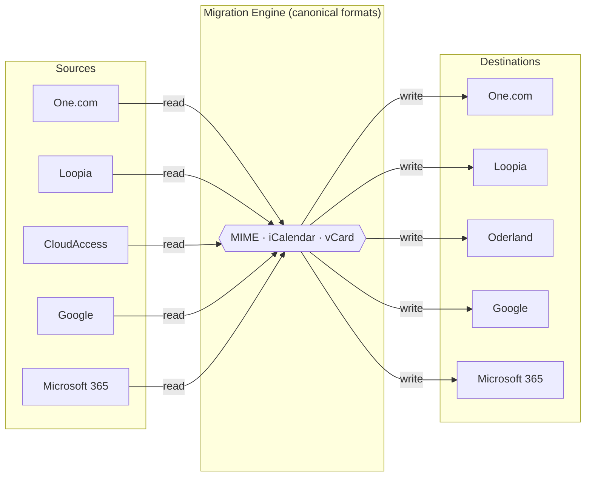
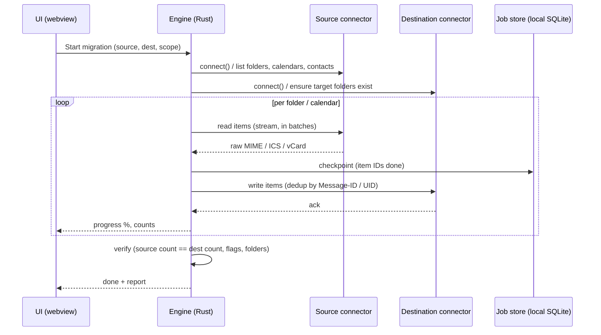
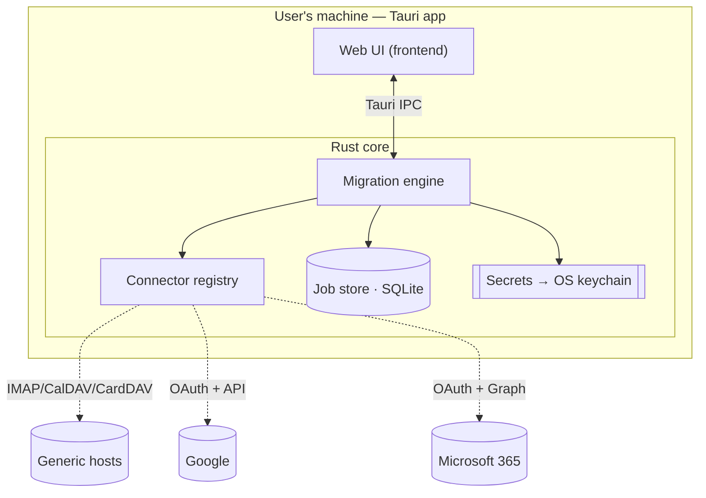

# Architecture

## Principles

1. **Local-first, zero-server.** All migration runs on the user's machine. There is no backend that
   touches mail data. (A static marketing/docs site and a license endpoint are the only online pieces,
   and neither sees user data.)
2. **Never hold credentials.** Secrets live in the OS keychain on the device. We can't leak what we
   never receive.
3. **Any provider → any provider.** Achieved with connectors, not per-pair integrations.
4. **No data loss.** Idempotent, resumable, verified. Calendar loss is unacceptable by requirement.

---

## The core idea: hub-and-spoke connectors

Naively building "One.com→Loopia", "M365→Google", … is an **N×N explosion**. Instead, every provider
is a **connector** that can *read* (as a source) and *write* (as a destination) in a **canonical
interchange format**. The engine in the middle is provider-agnostic and pipes source → destination.

Add a new provider = write **one** connector → it works with *every* other provider, both directions.



### Canonical formats (already universal standards — we get this for free)

| Data | Canonical format | Every connector reads/writes it because… |
| --- | --- | --- |
| Email | **MIME / RFC 5322** (raw bytes) | IMAP `APPEND`, Gmail API, and Graph all accept raw MIME. |
| Calendar | **iCalendar / ICS** (`VEVENT`) | CalDAV, Google Calendar, and Graph all speak ICS. |
| Contacts | **vCard** | CardDAV, Google People, and Graph all map to/from vCard. |

A connector's *only* job is **auth + read/write in these formats**. The engine never cares who is on
either end.

---

## Connectors we need (few connectors cover most of the market)

| Connector | Covers | Auth | Registration |
| --- | --- | --- | --- |
| **Generic IMAP + CalDAV + CardDAV** | One.com, Loopia, CloudAccess, Oderland, Fastmail, and a long tail of standard hosts | User credentials / app password | **None** |
| **Google** | Gmail / Google Calendar / Contacts | OAuth 2.0 (PKCE) — or app-password + IMAP/CalDAV | One app, registered once by us |
| **Microsoft 365** | Exchange Online / Outlook | OAuth 2.0 (PKCE) + **Microsoft Graph** (mandatory — Basic Auth is disabled) | One app, registered once by us |

> Registration is **once per provider, by the developer** — not per client. Desktop apps use the
> **PKCE / native-app** flow (no client secret, since a distributed binary can't keep one).

### Connector interface (Rust trait, sketch)

```rust
#[async_trait]
pub trait Connector {
    async fn connect(&mut self, creds: Credentials) -> Result<()>;

    // Email
    async fn list_folders(&self) -> Result<Vec<Folder>>;
    async fn read_messages(&self, folder: &Folder) -> Result<MessageStream>; // yields raw MIME
    async fn write_message(&self, folder: &Folder, mime: &[u8], flags: &Flags) -> Result<()>;

    // Calendar
    async fn list_calendars(&self) -> Result<Vec<Calendar>>;
    async fn read_events(&self, cal: &Calendar) -> Result<Vec<ICalObject>>;   // iCalendar
    async fn write_event(&self, cal: &Calendar, ics: &ICalObject) -> Result<()>;

    // Contacts
    async fn read_contacts(&self) -> Result<Vec<VCard>>;
    async fn write_contact(&self, card: &VCard) -> Result<()>;
}
```

Each provider implements this once. The engine holds two `Box<dyn Connector>` (source, destination)
and streams between them.

---

## Data flow (a migration job)



### Integrity & resumability (how we guarantee no loss)

- **Checkpointing.** Every processed item ID is recorded in a local SQLite job store. Interrupt at any
  time; resume continues exactly where it stopped.
- **Idempotent writes / dedup.** Messages deduped by `Message-ID`; events/contacts by `UID`. Re-runs
  never create duplicates.
- **Verification pass.** After migration, per-folder counts, flags (read/unread, flagged), and folder
  structure are compared source vs. destination and surfaced in a report.
- **Never delete the source.** We only copy. The source stays intact until the user manually retires it.

---

## Component view



- **Frontend (web UI):** wizard flow, progress, verification report. Pure presentation.
- **Rust core:** engine, connectors, job store, secrets. All network I/O and heavy lifting live here
  (the webview cannot open raw TCP sockets — IMAP/DAV must run in Rust).
- **Secrets:** stored via the OS keychain (`keyring` crate). Never written to disk in plaintext,
  never sent anywhere.

---

## Security model

- **No telemetry of content.** Optional, opt-in, anonymous *counts* at most — never mail data.
- **Credentials** in OS keychain; wiped on request; never transmitted off-device.
- **OAuth** uses PKCE with a loopback redirect; tokens stored in the keychain, refreshed locally.
- **Minimal dependency surface** (a core reason for choosing Tauri over Electron) — smaller supply-chain
  attack surface for a tool that handles passwords.
- **Signed & notarized** builds per platform for trustworthy distribution.
